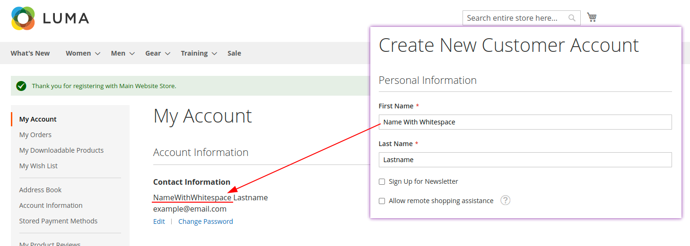
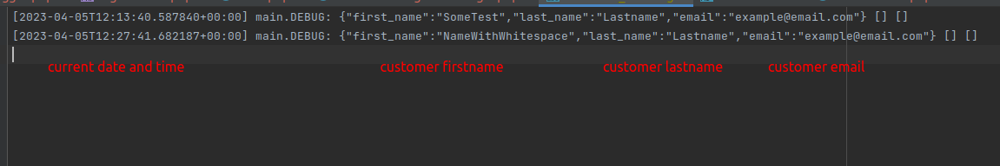
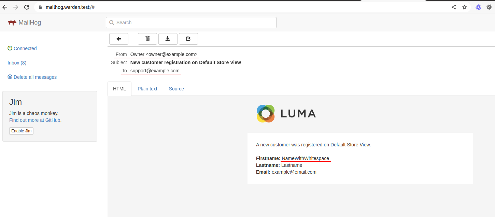

# Atwix_Customer module

This Magento 2 module was developed according to the requirements detailed in the accompanying PDF document:
[View task description](.readme/taskDescription.pdf "PDF")

The module modifies the customer registration process by validating the "First Name" field during a new customer’s registration.

If the "First Name" field contains any whitespaces, they are removed, ensuring the customer entity is saved with a clean "First Name" attribute.


Once the customer has been successfully registered, a log entry is added to the `var/log/customer_data.log` file:



Additionally, an email is sent to the customer support email from the general contact:


This behavior is also consistent across other areas, such as the admin panel and REST API.

### Installation details
Extract the zip file to "app/code" folder.

### Usage
In the admin panel, navigate to Stores > Configuration > General > Store Email Addresses and configure the "General Contact" and "Customer Support" sections.

### Aditional Information
This module has been tested on Magento 2.4.5 with PHP 8.1. The code was validated using PHPCS, PHPMD, and PHPStan, and unit tests were created using PHPUnit.

You can run the unit tests using the following Magento CLI command:
```
php -d xdebug.mode=coverage ./vendor/phpunit/phpunit/phpunit -c dev/tests/unit/phpunit.xml.dist app/code/Atwix/Customer --coverage-html coverage
```
